# Enterprise Digital Banking System

Enterprise Digital Banking System is a backend banking application built using Spring Boot and Java. The system simulates core banking operations such as account management, customer management, fund transfers, transaction processing, and secure authentication. It follows enterprise-level design principles and RESTful architecture to provide a scalable and maintainable banking solution.

## Features

- Customer Registration & Management
- Bank Account Creation
- Deposit & Withdrawal Operations
- Fund Transfers Between Accounts
- Transaction History Tracking
- Secure Authentication & Authorization
- RESTful APIs
- Database Integration with MySQL

