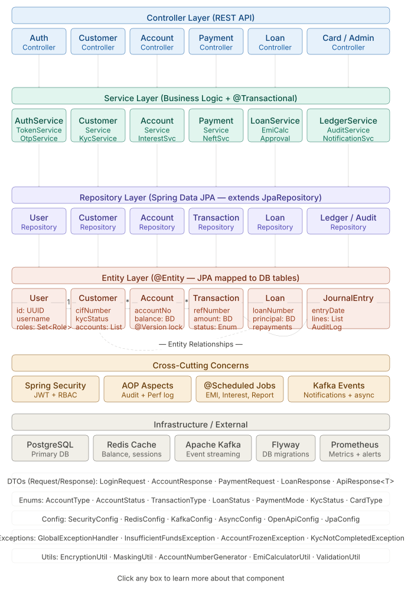

# Enterprise Digital Banking System

Enterprise Digital Banking System is a backend banking application built using Spring Boot and Java. The system simulates core banking operations such as account management, customer management, fund transfers, transaction processing, and secure authentication. It follows enterprise-level design principles and RESTful architecture to provide a scalable and maintainable banking solution.

## Features

- Customer Registration & Management
- Bank Account Creation
- Deposit & Withdrawal Operations
- Fund Transfers Between Accounts
- Transaction History Tracking
- Secure Authentication & Authorization
- RESTful APIs
- Database Integration with MySQL
- Event-Driven Notification Microservice (Apache Kafka)

## 90 Days Roadmap

| Day | Goal | Deliverables |
|---|---|---|
| 1 | Project Planning | Finalize architecture, create package structure, create Account entity & enums |
| 2 | Authentication Design | Create User entity, Role enum, UserRepository |
| 3 | Auth DTOs | RegisterRequest, LoginRequest, AuthResponse DTOs |
| 4 | Auth Service | UserService interface & implementation |
| 5 | Password Security | BCrypt password encoding, validation |
| 6 | Spring Security | Configure Spring Security |
| 7 | JWT | JWT Utility, JWT Filter, AuthenticationEntryPoint |
| 8 | Authentication APIs | Register & Login APIs |
| 9 | Testing | Test authentication using Postman |
| 10 | Exception Handling | Global exception handler & custom exceptions |
| 11 | Customer Module | Create Customer entity |
| 12 | Customer Repository | Repository & DTOs |
| 13 | Customer Service | Business logic |
| 14 | Customer APIs | CRUD operations |
| 15 | Customer Validation | Validation & testing |
| 16 | Account Module | Improve Account entity with Customer relationship |
| 17 | Account Repository | Repository & DTOs |
| 18 | Account Service | Create account business logic |
| 19 | Account APIs | Create/Get Account APIs |
| 20 | Account Testing | Complete Account module testing |
| 21 | Transaction Entity | Create Transaction entity |
| 22 | Transaction Repository | Repository & DTOs |
| 23 | Deposit | Deposit business logic |
| 24 | Withdraw | Withdraw business logic |
| 25 | Transfer | Money transfer logic |
| 26 | Transaction APIs | Deposit/Withdraw/Transfer endpoints |
| 27 | Transaction History | View transaction history |
| 28 | Transaction Validation | Handle edge cases & validations |
| 29 | Transaction Testing | Complete transaction testing |
| 30 | Refactoring | Clean code & optimization |
| 31 | Ledger Entity | Create LedgerEntry entity |
| 32 | Ledger Repository | Repository |
| 33 | Double Entry System | Debit & Credit entries |
| 34 | Ledger Service | Ledger business logic |
| 35 | Ledger APIs | Ledger history APIs |
| 36 | Ledger Testing | Verify accounting logic |
| 37 | Audit Entity | AuditLog entity |
| 38 | Audit Service | Automatic audit logging |
| 39 | Audit APIs | View audit history |
| 40 | Complete Audit Module | Testing |
| 41 | Beneficiary Entity | Create Beneficiary |
| 42 | Beneficiary APIs | CRUD |
| 43 | Beneficiary Validation | Validation & testing |
| 44 | Notification Microservice Setup | Scaffold separate Spring Boot project (notification-service), Kafka docker-compose |
| 45 | Kafka Producer | Banking app publishes transaction & beneficiary events to Kafka topics |
| 46 | Kafka Consumer | Notification service consumes events; Notification entity & abstraction |
| 47 | Email Notifications | Integrate mail sender in Notification service |
| 48 | Notification APIs & Testing | Notification history APIs, end-to-end event flow testing |
| 49 | Loan Entity | Loan model |
| 50 | EMI Entity | EMI schedule |
| 51 | Loan Repository | Repository |
| 52 | Loan Service | Loan logic |
| 53 | Loan APIs | Loan endpoints |
| 54 | Loan Approval | Approval workflow |
| 55 | Loan Testing | Testing |
| 56 | Redis | Redis configuration |
| 57 | Redis Cache | Cache account details |
| 58 | Kafka Error Handling | Dead-letter queue & retry configuration |
| 59 | Kafka Consumer Groups | Idempotent consumers & offset management |
| 60 | Kafka Monitoring | Topic/partition metrics, consumer lag |
| 61 | Async Notifications Review | End-to-end integration test across banking app & notification service |
| 62 | Logging | SLF4J & Logback |
| 63 | Monitoring | Spring Boot Actuator |
| 64 | Prometheus | Metrics |
| 65 | Grafana | Dashboard |
| 66 | Docker | Dockerfile |
| 67 | Docker Compose | PostgreSQL + Redis + Kafka + Notification Service |
| 68 | Profiles | Dev & Prod profiles |
| 69 | Flyway | Database migrations |
| 70 | PostgreSQL Optimization | Indexes & constraints |
| 71 | Unit Testing | JUnit setup |
| 72 | Service Tests | Business layer tests |
| 73 | Repository Tests | JPA tests |
| 74 | Controller Tests | MockMvc |
| 75 | Integration Testing | End-to-end testing |
| 76 | Validation | Bean Validation |
| 77 | Pagination | Pageable APIs |
| 78 | Sorting | Sorting support |
| 79 | Search | Dynamic search APIs |
| 80 | API Documentation | Swagger/OpenAPI |
| 81 | Security Review | Secure endpoints |
| 82 | Optimistic Locking | Concurrent transaction handling |
| 83 | Performance Review | Code optimization |
| 84 | Deployment | Prepare production build |
| 85 | AWS | Deploy backend |
| 86 | GitHub | Clean repositories (banking app + notification-service) & READMEs |
| 87 | Documentation | Architecture diagrams & notes |
| 88 | Resume | Add project to resume |
| 89 | Interview Preparation | Explain every module |
| 90 | Final Review | Complete testing, bug fixes, final polish |

### Milestones

**Phase 1 (Day 1–30)**
- Authentication
- Customer
- Account
- Transactions

**Phase 2 (Day 31–55)**
- Ledger
- Audit
- Beneficiary
- Notifications (separate microservice, Kafka event-driven)
- Loan Module

**Phase 3 (Day 56–70)**
- Redis
- Kafka (advanced: dead-letter queues, idempotent consumers, monitoring)
- Docker
- Flyway
- Monitoring

**Phase 4 (Day 71–90)**
- Testing
- Swagger
- AWS Deployment
- Documentation
- Resume
- Interview Preparation

### Daily Rule

Every day, document:
- What classes were created
- Why they were created
- Every annotation used
- Business logic implemented
- APIs completed
- Database changes
- Interview notes
- Questions learned

### By Day 90, you'll have

- A production-ready banking backend
- Complete project documentation
- 90 days of development notes
- A strong GitHub portfolio
- Material to confidently explain the project in interviews

