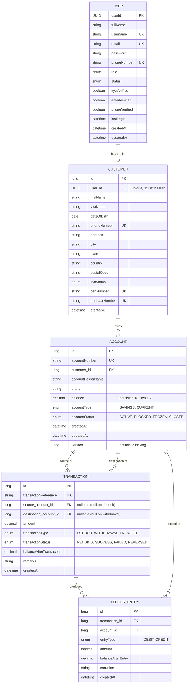
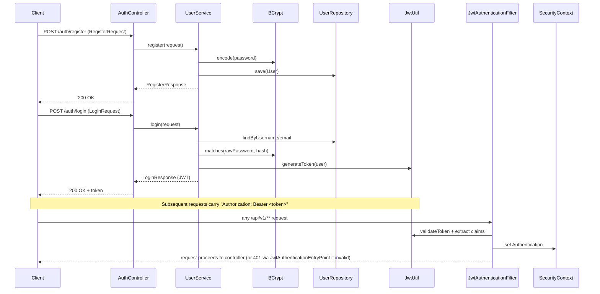
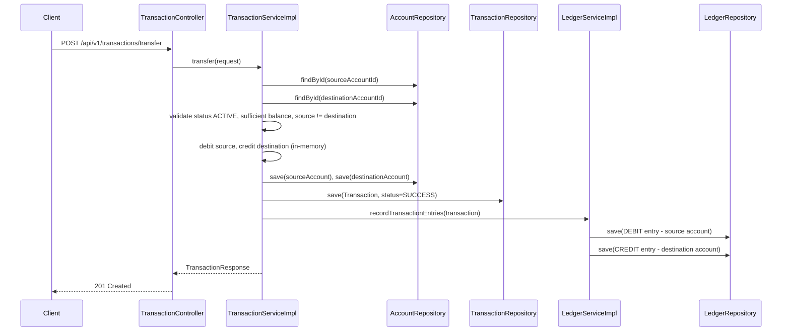

# Enterprise Digital Banking System — Project Overview

Snapshot as of **2026-08-28**, covering everything built so far against the 90-Day Roadmap
(Phase 1 complete, Phase 2 through the Ledger module complete — roughly **Day 1–35**).

---

## 1. Progress Snapshot

| Module | Roadmap Days | Status | Notes |
|---|---|---|---|
| Auth (User, Role, JWT, Security) | 1–9 | ✅ Done | Register/Login working, stateless JWT filter chain |
| Exception Handling | 10 | ✅ Done | Global handler + 6 custom exceptions |
| Customer | 11–15 | ✅ Done | Full CRUD + KYC completion endpoint |
| Account | 16–20 | ✅ Done | Full CRUD + freeze/close, optimistic locking (`@Version`) |
| Transaction | 21–30 | ✅ Done | Deposit / Withdraw / Transfer, balance validation, history |
| Ledger (double-entry) | 31–36 | ✅ Done (ahead of schedule) | Debit/credit entries auto-recorded per transaction |
| Audit | 37–40 | ⬜ Not started | Next up |
| Beneficiary | 41–43 | ⬜ Not started | |
| Notifications | 44–48 | ⬜ Not started | |
| Loan / EMI | 49–55 | ⬜ Not started | |

**Gaps worth closing soon:** no automated tests exist yet (only the default empty context-load
test), and there's no Postman collection checked in. Roadmap Days 9/15/20/29/36 called for testing
checkpoints — worth doing before Audit module work piles on more surface area.

---

## 2. Tech Stack

- **Language / Framework:** Java + Spring Boot (Spring Web, Spring Data JPA, Spring Security)
- **Database:** MySQL (`banking_db`), Hibernate `ddl-auto=update`
- **Auth:** JWT (stateless, custom filter), BCrypt password hashing
- **Build:** Maven
- **Money type:** `BigDecimal(precision=18, scale=2)` everywhere balances/amounts are stored — avoids float rounding errors, standard practice for financial systems

---

## 3. Package Structure

```
org.example.enterprisedigitalbankingsystem
├── auth/            User, Role, UserStatus, UserRepository, UserService(+Impl), DTOs, AuthController
├── customer/        Customer, KYCStatus, repository, mapper, service(+Impl), DTOs, CustomerController
├── account/         Account, AccountType, AccountStatus, repository, mapper, service(+Impl), DTOs, AccountController
├── transaction/      Transaction, TransactionType, TransactionStatus, repository, mapper, service(+Impl), DTOs, TransactionController
├── ledger/          LedgerEntry, EntryType, repository, mapper, service(+Impl), LedgerController
├── security/         JwtUtil, JwtAuthenticationFilter, JwtAuthenticationEntryPoint, SecurityConfig, CustomUserDetails(+Service)
├── exception/       GlobalExceptionHandler, ErrorResponse, 6 custom exceptions
└── config/          SecurityBeansConfig (PasswordEncoder bean etc.)
```

Each business module follows the same layered pattern: `entity → repository → service (interface + impl) → mapper → controller`, with request/response DTOs kept separate from entities.

---

## 4. ER Diagram



**Relationship notes:**
- `User ↔ Customer` is 1:1 — a `User` is the login/auth identity, `Customer` is the KYC/banking profile. Kept separate so `Role.EMPLOYEE`/`ADMIN`/`MANAGER`/`AUDITOR` users can exist without needing a Customer record.
- `Customer → Account` is 1:many — one customer can hold multiple accounts (savings + current).
- `Transaction.sourceAccount` / `destinationAccount` are both nullable FKs to `Account` — a deposit only sets `destination`, a withdrawal only sets `source`, a transfer sets both. This is why the entity has two separate `@ManyToOne` fields instead of one.
- Every `Transaction` produces one or two `LedgerEntry` rows (double-entry bookkeeping) — 1 for deposit/withdrawal, 2 (one DEBIT + one CREDIT) for transfer.

---

## 5. Database Schema (as generated by Hibernate `ddl-auto=update`)

| Table | Key Columns | Constraints |
|---|---|---|
| `users` | `user_id (UUID, PK)`, `username`, `email`, `phone_number` | unique on username, email, phone_number |
| `customers` | `id (PK)`, `user_id (FK→users, unique)`, `pan_number`, `aadhaar_number`, `phone_number` | unique on user_id, phone_number, pan_number, aadhaar_number |
| `accounts` | `id (PK)`, `account_number`, `customer_id (FK→customers)`, `balance`, `version` | unique on account_number; `version` column enables optimistic locking (`@Version`) |
| `transactions` | `id (PK)`, `transaction_reference`, `source_account_id (FK, nullable)`, `destination_account_id (FK, nullable)` | unique on transaction_reference |
| `ledger_entries` | `id (PK)`, `transaction_id (FK→transactions)`, `account_id (FK→accounts)` | not-null on transaction_id, account_id, entry_type, amount |

No Flyway/Liquibase yet — schema is auto-managed by Hibernate. This is fine for solo dev but **must be replaced with versioned migrations before Day 69 (Flyway) / production deployment** since `ddl-auto=update` is unsafe for real environments (silent, uncontrolled schema drift).

---

## 6. Data Flow Diagrams

### 6.1 Authentication Flow



### 6.2 Transaction + Double-Entry Ledger Flow (Transfer example)



**Key design points:**
- The whole flow runs inside one `@Transactional` boundary (class-level on `TransactionServiceImpl` and `LedgerServiceImpl`) — if ledger recording fails, the balance updates and transaction row roll back too. No partial state.
- Balance checks happen **before** any mutation (`insufficient balance` → `BadRequestException`, caught by `GlobalExceptionHandler`).
- `generateUniqueTransactionReference()` loops with `SecureRandom` until a non-colliding `TXN...` reference is found — collision-checked against the DB.
- Deposit → 1 ledger entry (CREDIT). Withdrawal → 1 ledger entry (DEBIT). Transfer → 2 ledger entries (DEBIT + CREDIT), which is the actual "double-entry" part.

---

## 7. API Reference

### Auth — `/auth` (public, no JWT required)

| Method | Endpoint | Body | Response |
|---|---|---|---|
| POST | `/auth/register` | `RegisterRequest` | `RegisterResponse` |
| POST | `/auth/login` | `LoginRequest` | `LoginResponse` (JWT token) |

### Customer — `/api/v1/customers` (JWT required)

| Method | Endpoint | Body | Response |
|---|---|---|---|
| POST | `/api/v1/customers` | `CreateCustomerRequest` | `CustomerResponse` (201) |
| GET | `/api/v1/customers/{customerId}` | — | `CustomerResponse` |
| GET | `/api/v1/customers/user/{userId}` | — | `CustomerResponse` |
| GET | `/api/v1/customers` | — | `List<CustomerSummaryResponse>` |
| PUT | `/api/v1/customers/{customerId}` | `UpdateCustomerRequest` | `CustomerResponse` |
| PATCH | `/api/v1/customers/{customerId}/kyc` | `CompleteKYCRequest` | `CustomerResponse` |
| DELETE | `/api/v1/customers/{customerId}` | — | 204 No Content |

### Account — `/api/v1/accounts` (JWT required)

| Method | Endpoint | Body | Response |
|---|---|---|---|
| POST | `/api/v1/accounts` | `CreateAccountRequest` | `AccountResponse` (201) |
| GET | `/api/v1/accounts/{accountId}` | — | `AccountResponse` |
| GET | `/api/v1/accounts/number/{accountNumber}` | — | `AccountResponse` |
| GET | `/api/v1/accounts/customer/{customerId}` | — | `List<AccountSummaryResponse>` |
| PUT | `/api/v1/accounts/{accountId}` | `UpdateAccountRequest` | `AccountResponse` |
| PATCH | `/api/v1/accounts/{accountId}/freeze` | `FreezeAccountRequest` | `AccountResponse` |
| PATCH | `/api/v1/accounts/{accountId}/close` | `CloseAccountRequest` | `AccountResponse` |

### Transaction — `/api/v1/transactions` (JWT required)

| Method | Endpoint | Body | Response |
|---|---|---|---|
| POST | `/api/v1/transactions/deposit` | `DepositRequest` | `TransactionResponse` (201) |
| POST | `/api/v1/transactions/withdraw` | `WithdrawRequest` | `TransactionResponse` (201) |
| POST | `/api/v1/transactions/transfer` | `TransferRequest` | `TransactionResponse` (201) |
| GET | `/api/v1/transactions/{transactionId}` | — | `TransactionResponse` |
| GET | `/api/v1/transactions/reference/{transactionReference}` | — | `TransactionResponse` |
| GET | `/api/v1/transactions/account/{accountId}/history` | — | `List<TransactionSummaryResponse>` |

### Ledger — `/api/v1/ledger` (JWT required)

| Method | Endpoint | Response |
|---|---|---|
| GET | `/api/v1/ledger/account/{accountId}` | `List<LedgerEntryResponse>` |
| GET | `/api/v1/ledger/transaction/{transactionId}` | `List<LedgerEntryResponse>` |

> ⚠️ **Note:** `SecurityConfig` currently permits only `/auth/**` without authentication; every other endpoint (`anyRequest().authenticated()`) requires a valid JWT in `Authorization: Bearer <token>`.

---

## 8. Domain Enums

| Enum | Values |
|---|---|
| `Role` | CUSTOMER, MANAGER, EMPLOYEE, ADMIN, AUDITOR |
| `UserStatus` | ACTIVE, INACTIVE, BLOCKED, SUSPENDED |
| `KYCStatus` | PENDING, IN_PROGRESS, VERIFIED, REJECTED |
| `AccountType` | SAVINGS, CURRENT |
| `AccountStatus` | ACTIVE, BLOCKED, FROZEN, CLOSED |
| `TransactionType` | DEPOSIT, WITHDRAWAL, TRANSFER |
| `TransactionStatus` | PENDING, SUCCESS, FAILED, REVERSED |
| `EntryType` | DEBIT, CREDIT |

---

## 9. Security Notes

- **Password hashing:** BCrypt via `PasswordEncoder` bean (`SecurityBeansConfig`).
- **JWT filter chain:** `JwtAuthenticationFilter` runs before `UsernamePasswordAuthenticationFilter`, extracts and validates the token, and populates `SecurityContext`.
- **Session policy:** `STATELESS` — no server-side session, every request re-authenticates via the token.
- **Unauthorized access:** handled by `JwtAuthenticationEntryPoint`, returning a structured 401 instead of the default Spring redirect/HTML page.
- **CSRF:** disabled — appropriate here since this is a stateless token-based API, not cookie/session-based.

---

## 10. Key Annotations Used (and why)

| Annotation | Where | Why |
|---|---|---|
| `@Entity`, `@Table` | all entities | JPA persistence mapping |
| `@Id`, `@GeneratedValue` | all entities | PK strategy — `IDENTITY` for most, `UUID` for `User` (avoids exposing sequential/guessable user IDs) |
| `@ManyToOne`, `@OneToOne`, `@JoinColumn` | Customer, Account, Transaction, LedgerEntry | relationship mapping; all lazy-fetched to avoid N+1 / over-fetching |
| `@Version` | Account | optimistic locking — prevents lost updates when two transactions hit the same account concurrently |
| `@PrePersist` / `@PreUpdate` | all entities | auto-stamp `createdAt`/`updatedAt`, default enum values (e.g. `AccountStatus.ACTIVE`, `TransactionStatus.PENDING`) |
| `@Transactional` (class-level) | all `*ServiceImpl` | wraps each service method in a DB transaction so multi-step writes (balance update + transaction row + ledger rows) commit or roll back atomically |
| `@Transactional(readOnly = true)` | read methods | hints Hibernate to skip dirty-checking/flush for read paths |
| `@RestController`, `@RequestMapping` | controllers | REST endpoint mapping |
| `@Valid`, `@RequestBody` | controller methods | triggers Bean Validation on incoming DTOs before hitting service layer |
| `@RequiredArgsConstructor` (Lombok) | services, controllers | constructor injection for `final` fields without boilerplate |
| `@Builder`, `@Getter`, `@Setter` (Lombok) | entities | reduces boilerplate; `@Builder` used heavily when constructing entities in service/ledger code |
| `@ControllerAdvice` / `@ExceptionHandler` | `GlobalExceptionHandler` | centralizes error → HTTP response mapping (Day 10 deliverable) |

---

## 11. Known Gaps / Tech Debt

1. **No automated tests.** Only the default empty `EnterpriseDigitalBankingSystemApplicationTests`. No Postman collection checked in either.
2. **No daily dev notes** — the roadmap's Daily Rule (classes created, annotations, business logic, interview notes per day) hasn't been kept; this doc is a retroactive catch-up, not a replacement for going forward.
3. **`ddl-auto=update`** — fine for now, but needs to become Flyway migrations before Day 69 / before any real deployment.
4. **Ledger is coupled synchronously** into `TransactionServiceImpl` — correct for now given the shared `@Transactional` boundary, but will need to be revisited once Kafka/event-driven notifications are introduced (Day 58+) so ledger writes stay authoritative and don't become a bottleneck.
5. **No audit trail yet** (Day 37 module) — currently nothing records *who* performed an action, only *what* happened via the ledger.

---

## 12. Next Up (Day 36+)

- Day 36: finish Ledger testing/verification (double-entry sums should net to zero per transaction).
- Day 37–40: Audit module — `AuditLog` entity, automatic logging (likely via AOP `@Around` on service methods, or a Spring event listener), audit history APIs.
- Before starting Audit: recommend adding a minimal test suite (deposit/withdraw/transfer + ledger balance assertions) so future changes have a regression safety net.
